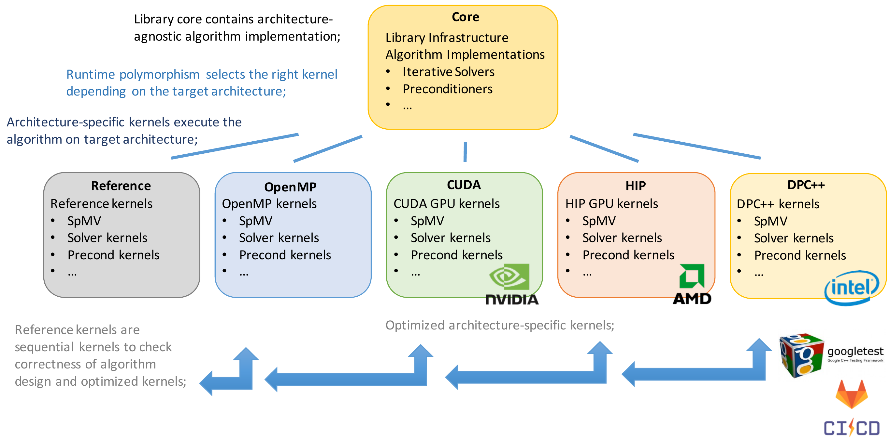

# Library Architecture

<!-- _class: lead -->

Early-Adopter Session 08.01.2025


## File Categories

The Ginkgo source code contains three kinds of source/header files:

- Public API header files
  - These files should not contain any implementation, except for templates
- Private source and header files containing the implementations
- Source files for tests

## Public API Files

The header files in `include/ginkgo/` are the public API of Ginkgo.
`core/`: Main features of Ginkgo.
`extension/`: Additional features, which require third-party libraries.

The `include/ginkgo/ginkgo.hpp` includes all `core` headers, but no `extension` headers.

Headers are thematically grouped. Examples:

- `core/matrix` contains API for matrix formats
- `core/solver` contains API for linear solvers

The same grouping is repeated for private and test files.

## Private Implementation Files

Implementation files are split between *algorithm* and *kernel* files.
Algorithm files: contain high-level, device independent control code.
Kernel files: contain device dependent, high-performance code.

Kernel files are bundled into separate libraries.
Each library corresponds to one executor.

Separating the kernel implementation for each backend allows using different code in each backend.

---




## File Correlations

Every public API header has a corresponding private source file.
The source file is in `core/` following the same grouping as in `include/ginkgo/core`.
Ex: `include/ginkgo/core/matrix/csr.hpp -> core/matrix/csr.cpp`

The source file implements the functions declared in the header file.
It uses the device dependent kernels defined in `core/.../*_kernels.hpp`.
Ex: `core/matrix/csr_kernels.hpp`

Kernels are implemented in each backend.
Ex: `reference/matrix/csr_kernels.cpp`
Ex: `omp/matrix/csr_kernels.cpp`
Ex: `cuda/matrix/csr_kernels.cu`
...


## Common Kernels

Simplistic kernels are implemented once for all backends (excluding reference) in `common/unified`.
Only available for kernels that can be expressed as a parallel-for or a reduction.


CUDA and HIP kernels are implemented in `common/cuda_hip`.
They share the same code, only configuration and library calls differ.

## Test Files

Tests in Ginkgo are grouped into the following categories:

- Device independent tests (construction, copy, move, etc.)
  - Implemented in `core/test`
- Reference kernels
  - Implemented in `reference/test`
- Device dependent tests
  - Implemented in `test`
  - For rare cases, implemented in `BACKEND/test`


## Directory structure

```text
common
  cuda_hip      <-- CUDA/HIP kernels
  unified       <-- device kernels (except reference)
core            <-- implementation files for include/ginkgo/core
core/test       <-- device independent tests
cuda            <-- CUDA configuration
dpcpp           <-- SYCL kernels
hip             <-- HIP configuration
include/ginkgo
  core          <-- public API
  extensions    <-- optional API
omp             <-- OpenMP Kernels
reference       <-- reference kernels
reference/test  <-- reference tests
test            <-- device dependent tests
```
