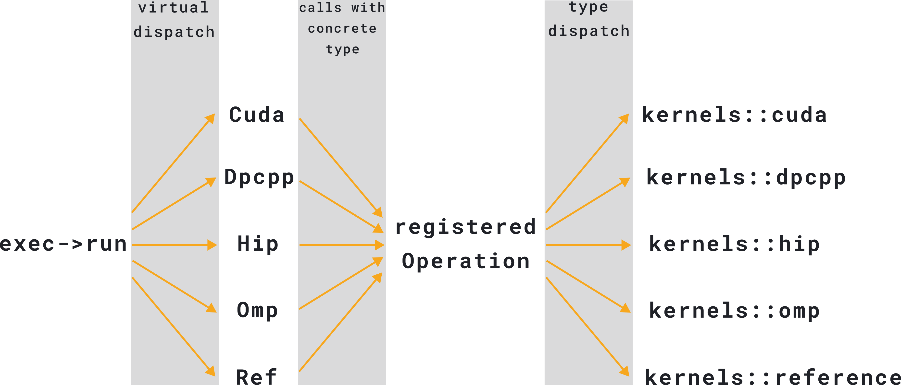

# Calling Kernels

<!-- _class: lead -->

Early-Adopter Session 15.01.2025


# Calling Kernels

Each kernel needs to be made available in every core source file it is used:

1. Include the kernel header file, e.g. `core/matrix/csr_kernels.hpp`
2. Register the kernel with the `GKO_REGISTER_OPERATION` macro

Pass registered operation to `exec->run`.

# Example

```c++
#include "core/components/prefix_sum_kernels.hpp"

namespace gko{
namespace {
  GKO_REGISTER_OPERATION(prefix_sum, components::prefix_sum_nonnegative);
}

void fn(std::shared_ptr<const Executor> exec, ...){
  ...
  exec->run(make_prefix_sum(data, size));
  ...
}

}
```

# Kernel Declaration

<style scoped>
section pre > code {
  font-size: 18px;
}
</style>

Each kernel is declared multiple times, in each backend namespace.
A kernel `foo(std::shared_ptr<const DefaultExecutor>, size_type size, int* data)` has the declarations:
```c++
namespace kernels::reference{
  void foo(std::shared_ptr<const DefaultExecutor>, size_type size,int* data);
}
namespace kernels::omp{
  void foo(std::shared_ptr<const DefaultExecutor>, size_type size, int* data);
}
namespace kernels::cuda{
  void foo(std::shared_ptr<const DefaultExecutor>, size_type size, int* data);
}
namespace kernels::dpcpp{
  void foo(std::shared_ptr<const DefaultExecutor>, size_type size, int* data);
}
namespace kernels::hip{
  void foo(std::shared_ptr<const DefaultExecutor>, size_type size, int* data);
}
```

# Operations

Calling `make_prefix_sum` doesn't execute the kernel.
Instead, an object that implements `gko::Operation` is created.

```c++
class Operation {
public:
    virtual void run(std::shared_ptr<const CudaExecutor> exec) const;
    virtual void run(std::shared_ptr<const DpcppExecutor> exec) const;
    virtual void run(std::shared_ptr<const HipExecutor> exec) const;
    virtual void run(std::shared_ptr<const OmpExecutor> exec) const;
    virtual void run(std::shared_ptr<const ReferenceExecutor> exec) const;
    virtual const char* get_name() const noexcept;
};
```

The arguments passed to `make_prefix_sum` are stored in this object.

# User Defined Operation

Users can create custom subclasses of `gko::Operation` to let Ginkgo execute user kernels.
Example: see `custom-matrix-format`

Alternative: Call `exec->run(...)` with a name and 5 lambda functions:
```c++
exec->run("custom-kernel", [&]{ ref_kernel(); }, [&]{ omp_kernel(); }, ...);
```

This will enqueue the kernels on the same stream that Ginkgo uses, and enable Ginkgo logging for the custom kernels.


# Register Macro Magic

<style scoped>
section pre,
section ul {
  margin: 0.5em 0 0;
}
section pre > code {
  font-size: 18px;
}
section p,
section li{
  font-size: 20px
}
</style>

The macro `GKO_REGISTER_OPERATION(_name, _kernel)` expands to

```c++
template<typename...Args>
auto make_##_name(Args&& ...args) {
  return detail::make_register_operation(#_kernel, [&args...](auto exec) {
    using exec_type = decltype(exec);
    if (std::is_same<exec_type, std::shared_ptr<const ReferenceExecutor>>::value) {
      kernels::reference::_kernel(std::dynamic_pointer_cast<const ReferenceExecutor>(exec), std::forward<Args>(args)...);
    }
    else if (std::is_same<exec_type, std::shared_ptr<const OmpExecutor>>::value) {
      kernels::omp::_kernel(std::dynamic_pointer_cast<const OmpExecutor>(exec), std::forward<Args>(args)...);
    }
    else if (std::is_same<exec_type, std::shared_ptr<const CudaExecutor>>::value) {
      kernels::cuda::_kernel(std::dynamic_pointer_cast<const CudaExecutor>(exec), std::forward<Args>(args)...);
    }
    else if (std::is_same<exec_type, std::shared_ptr<const HipExecutor>>::value) {
      kernels::hip::_kernel(std::dynamic_pointer_cast<const HipExecutor>(exec), std::forward<Args>(args)...);
    }
    else if (std::is_same<exec_type, std::shared_ptr<const DpcppExecutor>>::value) {
      kernels::dpcpp::_kernel(std::dynamic_pointer_cast<const DpcppExecutor>(exec), std::forward<Args>(args)...);
    }
    else {
      GKO_NOT_IMPLEMENTED;
    }
  });}
```

# Two-Step Dispatch

