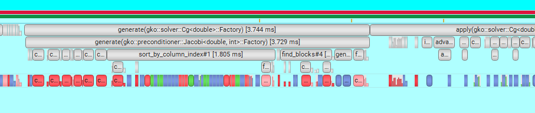

# Logging in Ginkgo

<!-- _class: lead -->

Early-Adopter Session 22.01.2025

## Logger Events

Ginkgo exposes logging events for nearly all of its functionality. Examples:

- LinOp apply
- Memory allocation/free
- Completed solver iteration

Events are logged as distinct `*_started`, `*_completed` pairs:
```c++
this->template log<log::Logger::linop_apply_started>(this, b.get(), x.get());
this->apply_impl(make_temporary_clone(exec, b).get(),
                 make_temporary_clone(exec, x).get());
this->template log<log::Logger::linop_apply_completed>(this, b.get(), x.get());
```

## Enable Logging

Logging is only enabled on a per-object basis. A logger has to be attached to the relevant object to enable logging.

Which events are logged depends on the concrete logger! 
A logger attached to an object that doesn't call the events enabled by the logger will not do anything.

Example: A logger for memory allocation events attached to a matrix object will not be activated at all, even if internally memory allocation events occur.

There is *no* system-wide logging. The closest alternative is attaching loggers to executors.


## Adding Loggers

Loggers are added to objects derived from `gko::Loggable` via `add_logger` as shared_ptrs. Logger can also be removed. All LinOp and executors types are derived from `gko::Loggable`.

Example for logging a solver application:
```c++
auto logger = gko::share(gko::log::Convergence::create());
solver->add_logger(logger);
solver->apply(b, x);
```

Enable specific events in the `create` function (not available for all loggers):

```c++
auto logger = gko::share(gko::log::Stream::create(
  std::cout, 
  gko::log::Logger::allocation_started_mask | gko::log::Logger::allocation_completed_mask));
```


## Predefined Loggers

Currently available loggers by category:

- Iterative solvers:
  - `Convergence`, `BatchConvergence`, and `SolverProgress`
  - Should be attached to iterative solver object
- Generic introspection:
  - `Papi`, `Record`, and `Stream`
  - Can be attached to any object
- Profiling:
  - `PerformanceHint`, and `ProfilerHook`
  - Should be attached to executor object

## Loggers for Iterative Solvers

- `Convergence` logs the convergence results of a solver
  - Provides access to convergence state, final residuum vector and norm, and number of iterations
  - Go-to for light-way convergence checking
- `BatchConvergence` same, but for solving batched systems
- `SolverProgress` reports scalar (and vector) values of each solver iteration 
  - Output for scalar values either as ASCII or CSV table
  - Vector values are stored in file using matrix-market format
  - Useful to investigate convergence history

## Loggers for Generic Introspection

- `Papi` provides Ginkgo events as PAPI software defined events.
  - Usually used in combination with other performance tools.
- `Record` stores any objects associated with an event
  - E.g. logs input/output to linop apply calls.
  - High memory consumption, since it logs all events by default.
  - Users should try to only select interesting events.
  - Can store (truncated) history of events
- `Stream` logs stringified events to an IO stream, usually a file or console

## Loggers for Profiling

- `PerformanceHint` highlights common performance pitfalls
  - Currently supports detection of repeated allocation/free pairs of same size, and cross-executor copies of same address
- `ProfilerHook` annotates Ginkgo with third-party specific profiler ranges
  - Supports the tools NVTX, ROCTX, VTune, and Tau
  - Annotated ranges are visible in the corresponding profiler tool, e.g. Nsight Systems
  - Provides simple profiling table in markdown format


## ProfilerHook NVTX Example




## ProfilerHook Summary Example

```
Summary
Overhead estimate 674.4us 
|                            name             |  total   | total (self) | count |   avg    | avg (self) |
|---------------------------------------------|---------:|-------------:|------:|---------:|-----------:|
| total                                       |  11.4ms  |       5.8ms  |     1 |  11.4ms  |     5.8ms  |
| apply(gko::solver::Cg<double>)              |   3.5ms  |       1.6ms  |     1 |   3.5ms  |     1.6ms  |
| generate(gko::solver::Cg<double>::Factory)  |   1.6ms  |      58.2us  |     1 |   1.6ms  |    58.2us  |
| check(gko::stop::Combined)                  | 593.6us  |     152.6us  |     8 |  74.2us  |    19.1us  |
| sort_by_column_index#1                      | 505.0us  |     505.0us  |     1 | 505.0us  |   505.0us  |
| generate#9                                  | 493.6us  |     448.4us  |     1 | 493.6us  |   448.4us  |
| check(gko::stop::ResidualNorm<double>)      | 393.7us  |     261.4us  |     8 |  49.2us  |    32.7us  |
| apply(gko::matrix::Csr<double, int>)        | 340.8us  |     188.5us  |     7 |  48.7us  |    26.9us  |
...
```
